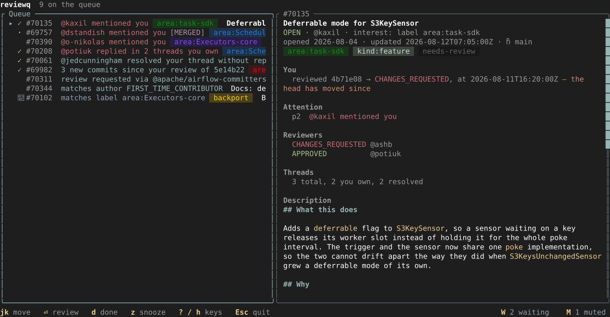
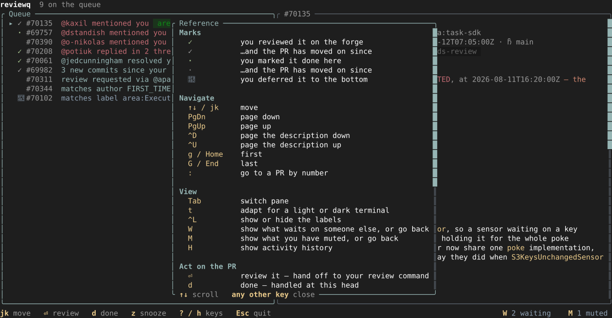
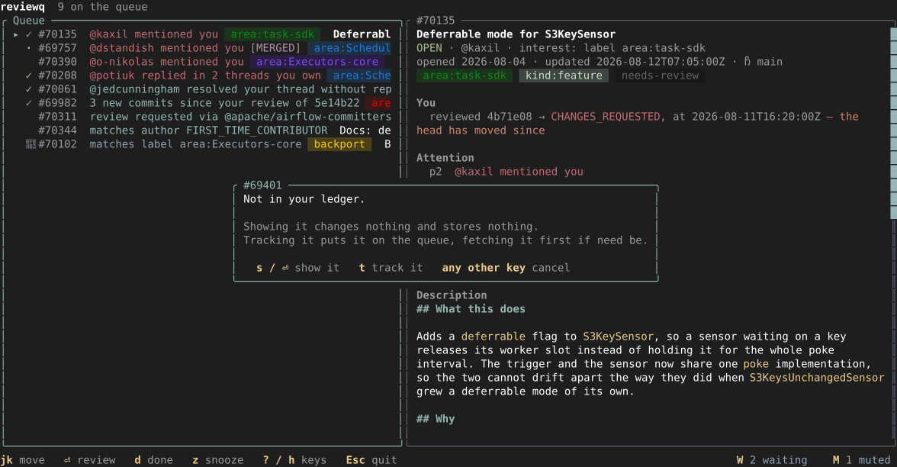
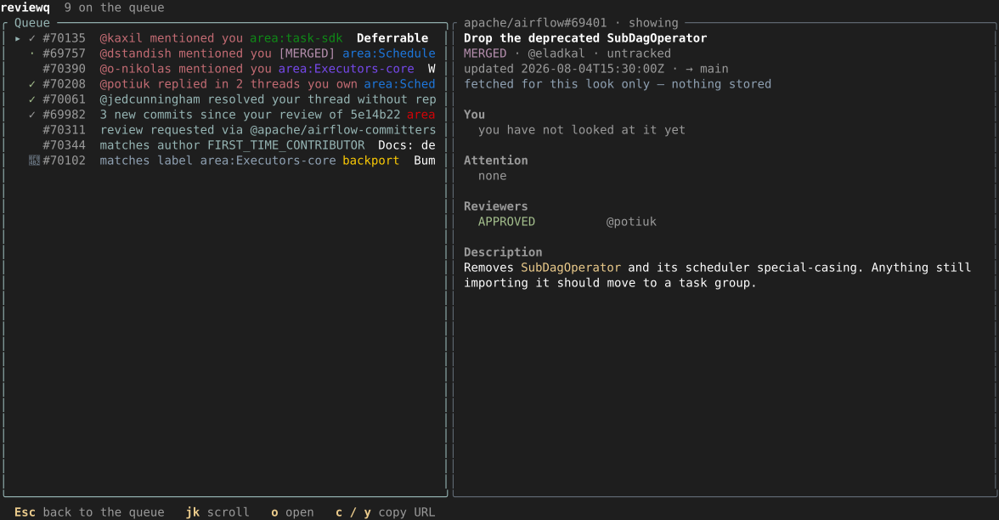
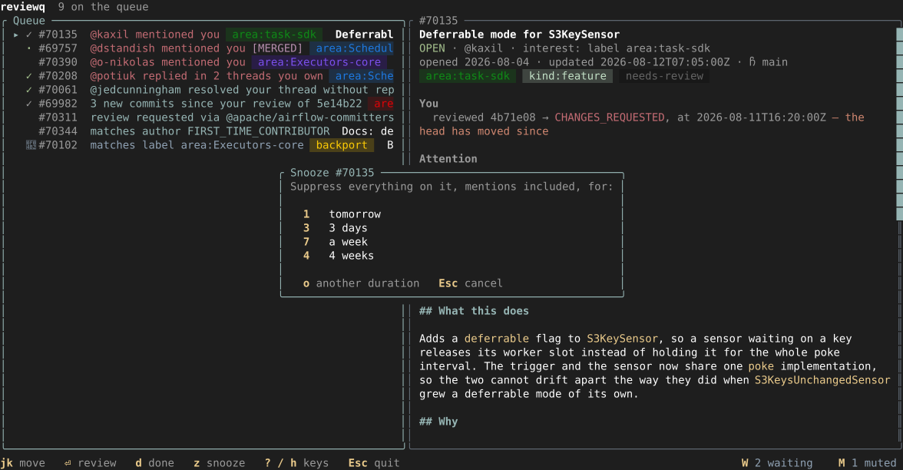
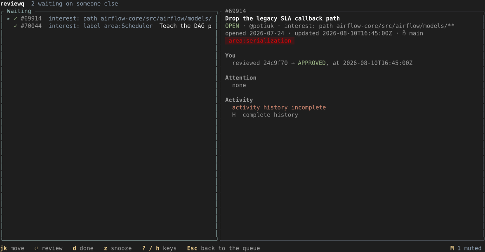
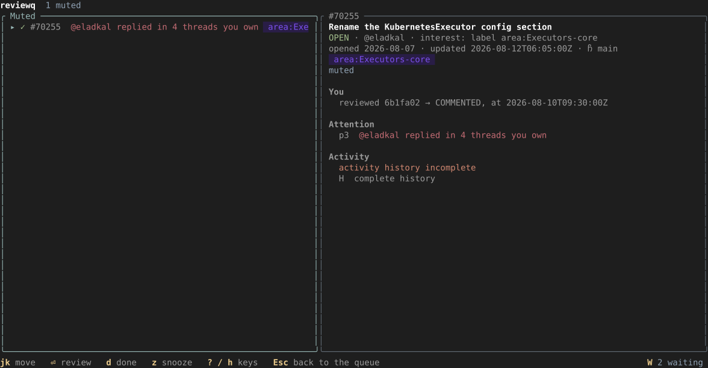
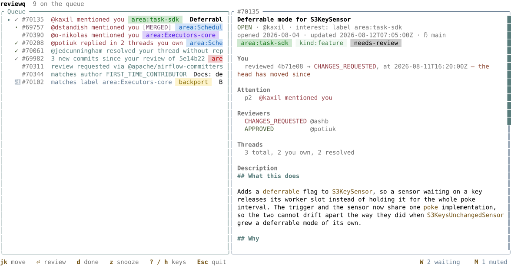

# reviewq

A deterministic pull-request review queue. It answers one question — *what should
I look at next?* — and every answer names the rule that produced it.

Not a notifications client. reviewq computes the queue itself from what the forge
reports, so a PR appears because something about it matches a rule you wrote or
because it names you, never because an email arrived. The state that GitHub does
not keep for you — which head SHA you last reviewed, what you have acknowledged,
what you have snoozed — lives in a local ledger, which is what makes "has this
changed since I looked?" answerable.



Every row says why it is there, most urgent first, carries the labels your project
asked to see — as chips, in the colours the repo paints them, which `reviewq sync
--labels` brings in — and a mark for what you have already done to it: `✓` a
review you submitted on the forge, `·` a `done` of your own — dimmed once the PR
has moved past the head that mark names — and `󰒲` for one you deferred. The
pictures on this page are generated from a fixture by the interface itself, so
they cannot drift from what it draws. `reviewq list` marks its rows with the same
glyphs, from the same `[output.marks]`, and tags a PR whose snooze is still
running — so a row at the bottom of either says why it is down there.

## Getting started

```sh
cargo install --path crates/reviewq
reviewq sync      # writes a documented default config on first run
reviewq doctor    # token, budget, checkout, where things live
reviewq list      # the queue, most-urgent first
reviewq tui       # the same queue, browsable
```

The config lives at `$XDG_CONFIG_HOME/reviewq/config.toml` and is written for you,
comments and all, the first time it is needed. `reviewq doctor` reports on
everything it needs to be true before a sync can work, and says which of it isn't.

XDG applies on macOS too, so `$XDG_CONFIG_HOME` and `$XDG_DATA_HOME` move both the
config and the ledger (`reviewq.db`); `REVIEWQ_CONFIG` and `REVIEWQ_DB` name either
one outright, and `--config PATH` does the same for a single run. A path named
explicitly is never created for you — asking for a specific file and silently
getting a fresh default would hide a typo.

## Why a PR is on the queue

Six reasons, in the order the queue sorts them. A PR carries every one that fires
and is ranked by its most urgent; within a band, oldest first. Nothing here reads
a clock beyond "now" or touches the network, so a fixture plus a timestamp
reproduces a queue exactly.

| | Reason | Reads as | Cleared by |
|---|---|---|---|
| 1 | `mention` | *@potiuk mentioned you* | anything you do on the PR, or `done` |
| 2 | `thread_reply` | *@potiuk replied in 2 threads you own* | replying in that thread, or `done` |
| 3 | `resolved_unanswered` | *@potiuk resolved your thread without replying* | `done`, and only `done` — it means *go check the fix* |
| 4 | `re_review` | *3 new commits since your review of 5e14b22* | reviewing the new head, or `done` at it |
| 5 | `review_requested` | *review requested via @airflow-committers* | reviewing the current head |
| 6 | `needs_first_look` | *matches label area:task-sdk* | anything at all — it only ever fires once |

Reasons 1–3 come from what people said, 4–5 from what the forge asked of you, and
6 from your own interest rules. Bands 1 and 2 — where a person is waiting on a
reply from you — are coloured apart from the rest in both `list` and the
interface, and a deferred row is quieted in both; which rows shout is one
decision, though each paints it in its own palette.

A reason answers a question the forge cannot: not *did something happen*, but
*has something happened since I last looked*.

Some states silence a PR before any of that is computed. A snooze suppresses
everything until it lapses, mentions included, and consumes nothing — the same
reasons reappear afterwards unchanged. A closed-unmerged PR is abandoned and stays
silent. A draft lets only a mention through. A *merged* PR is silent too, unless
the project sets `include_merged` or the rule that matched sets `after_merge`,
which is how a post-merge reply gets to flag something that shipped broken.

A mute is not one of these: it is a statement about what you want shown rather
than about the PR, so the reasons stay computed while it hides them — see
[the interface](#the-interface).

### Which verb, and when

Two families. Most of them **suppress** — they hide a row, and differ only in
what brings it back. `done` **acknowledges**: it hides nothing and moves your
watermark, saying you have accounted for the PR as it stands. It is still yours,
still watched, still there in the waiting list; it just stops being new to you
until it moves.

| You want to say | Verb |
|---|---|
| I am up to date with this PR | `done` |
| I am waiting on them | *nothing* — that is where a PR goes by itself |
| Not now, ask me later | `snooze <dur>` |
| This matters less than the rest | `defer` |
| Stop showing me this | `mute` |
| I am not reviewing this, ever | `untrack` |

**`done` — I have accounted for this PR as it stands.** The forge already knows
what you did in public: your comments, your reviews, your resolutions. It cannot
know that you read a mention and had nothing to add, checked somebody's fix and
were satisfied, or skimmed a PR a rule surfaced and decided it was not yours.
`done` is how you record a decision that left no trace. Anything new on the PR
brings it back.

Which is why you will not reach for it often — you review on the forge, and the
forge tells reviewq for you. It is for the times you looked and did nothing:

- Someone @mentioned you and no answer is needed.
- Someone replied *"fixed"* in a thread of yours and you have verified it.
- New commits landed; you have looked and do not need to re-review.
- A rule surfaced a PR; you skimmed it and it is not yours.
- Someone resolved your thread without answering; you checked the fix.

`done` is not "I am not interested" — that is `mute` for now, or `untrack` for
good, and only `untrack` drops the reason the PR was watched at all, so that
neither the queue nor the waiting list nor a rule that still matches will bring
it back. A closed or merged PR needs none of them: it leaves by itself once a
sync or a refresh (`r`) learns what happened to it.

One case none of these covers: a review somebody asked you for and you do not
intend to give. "Up to date" is untrue, and hiding it says nothing to the person
waiting — so take yourself off the reviewer list on the forge, and reviewq will
stop asking at the next sync.

## Commands

| | |
|---|---|
| `sync [N] [--labels]` | Fetch from the forge and rebuild the ledger, refresh one PR, or bring in each repo's label palette |
| `list [--all\|--waiting\|--muted] [--json]` | The queue, everything tracked, what waits on someone else, or what you have silenced — each row with the mark and any live snooze |
| `next [--json]` | Just the most urgent one |
| `show <N\|url> [--json]` | Everything known about one PR and why it is on the queue |
| `done <N>` | Say you have accounted for the PR as it stands, and mark its notifications read |
| `snooze <N> <dur>` / `mute` / `unmute` | Suppress a PR for a while, or until told otherwise |
| `defer <N>` / `undefer` | Sink it to the bottom without hiding it |
| `track <N\|url>` | Track a PR a rule didn't match, fetching it if the ledger has never seen it |
| `untrack <N>` | Stop watching it for good — off every list, and no rule takes it back |
| `review <N>` | Hand off to your review command; does not imply `done` |
| `tui` | The interactive queue; `?` lists the keys |
| `doctor` | What is wrong, and where things live |

## The interface

`?` opens the reference: what the marks mean, every key, and the mouse.



`:` goes to a PR by number. One that isn't on the queue — merged, closed, never
tracked, or never even swept — is not a refusal: showing a PR is read-only and
always possible, so that is offered, with tracking alongside it where that would
mean anything.



Taking the offer fetches it into a scratch view that is never stored, and says so.
`Esc` returns to the queue.



`z` snoozes, offering the durations anyone actually picks and a prompt for the
one you meant instead. `d` marks it done at the current head, `f` sinks it to the
bottom, `m` silences it, `u` stops watching it altogether, `⏎` hands it to your
review command, and `r` refetches just that PR. `S` sweeps every configured repo
— the same work `reviewq sync` does — in the background, so the queue stays
readable while it runs and takes up what the sweep committed once it lands.



The branch a PR targets is drawn behind a  icon; `[output.icons] branch` names
the glyph, and `""` drops it for a terminal whose font cannot draw one.

The detail pane dates a PR twice, because the two answer different questions:
*opened* is how long its author has been waiting, *updated* whether anything has
happened lately. Neither is when reviewq first saw it. A row swept by a build
before the opening date was captured has none, and says nothing rather than
guessing; `show --json` keeps both to the second.

`W` shows what you are waiting on: tracked, open, wanting nothing — where a PR
goes the moment you review it, since the ball is then in the author's court. It
comes back to the queue by itself when they push (as *"3 new commits since your
review of 5e14b22"*) or answer in a thread you own.



`M` shows what you have muted. A mute says what you want shown rather than what
is true of the PR, so the reasons stay computed while it is hidden — which is what
lets this list say why each one would be on the queue, and what makes `m` put one
straight back rather than leaving it blank until the next sync.



Both lists are counted in the footer beside the key that opens them, so a list
with something on it says so without being opened.

`Esc` leaves whichever of them you are in — the same thing it does to an overlay
or a shown PR, so one key always means *out of this*. On the queue there is
nothing left to leave and it quits, which `q` does from anywhere.

The palette adapts to a light terminal with `t`, or `[output] theme = "light"`.



## Configuring it

The file is TOML, validated once at load — a bad glob, an unknown theme or a repo
on a host with no forge entry is an error before any work starts rather than
halfway through a sync. Unknown keys are tolerated, so a config written for a
later version still loads.

### Who you are, and what you watch

```toml
[identity]
login = "ashb"          # every reason is computed relative to this account

[[project]]
name  = "airflow"
repos = [{ owner = "apache", name = "airflow", path = "~/code/airflow" }]
show_labels = ["area:", "backport"]
```

A project bundles repos with the rules that apply to them; add another
`[[project]]` for a codebase whose conventions differ. `path` is the local
checkout — reviewq never reads a working tree, the queue comes from the forge, but
the handoff runs there, which is what lets a review tool publish back to the pull
request.

`show_labels` names the label families worth a chip on a queue row. A pattern
ending in a separator is a prefix (`area:` takes every `area:*`); anything else is
a whole label name. A row has space for two or three beside the title, so naming
the handful you steer by is the point — the detail pane shows every label
regardless. `reviewq sync --labels` brings in each repo's palette so the chips are
drawn in the colours the repo paints them.

### Interest rules

A PR is interesting if **any** rule matches. Within a rule, any listed value of a
dimension matches, and a rule setting several dimensions requires all of them — an
AND of ORs. Every rule must set at least one of `labels`, `paths`, `authors`,
`author_associations` or `milestones`.

```toml
# Labels do most of the work where a bot maintains them: apache/airflow's
# boring-cyborg.yml maps paths to area labels upstream, for free.
[[project.interest]]
labels = ["area:task-sdk", "area:serialization", "area:Scheduler"]

# Globs against the changed files, for what labels miss.
[[project.interest]]
paths = ["task-sdk/**", "airflow-core/src/airflow/serialization/**"]

# GitHub's own author classes: FIRST_TIME_CONTRIBUTOR, FIRST_TIMER, NONE,
# CONTRIBUTOR, COLLABORATOR, MEMBER, OWNER.
[[project.interest]]
author_associations = ["FIRST_TIME_CONTRIBUTOR"]

# Named people, for what a relationship class cannot say — whose PRs these are.
[[project.interest]]
authors = ["potiuk"]

# Substring match against the milestone title.
[[project.interest]]
milestones = ["3.2"]
```

An unnamed rule describes itself by what matched (`label area:task-sdk`, `path
task-sdk/**`, `author @potiuk`), which is what a row's *matches …* reads. Setting
two dimensions means both at once, and a `name` says in one phrase what the
joined-up version would spell out:

```toml
[[project.interest]]
name                = "first-timer in the task sdk"
author_associations = ["FIRST_TIME_CONTRIBUTOR"]
paths               = ["task-sdk/**"]
```

`after_merge` keeps one rule's PRs on the queue past the merge, so a post-merge
reply still reaches you where it matters, while the rest of the project ends at
merge as usual. `include_merged = true` on the project is the blunt version of the
same thing.

```toml
[[project.interest]]
authors     = ["a-new-name"]
paths       = ["airflow-core/src/airflow/serialization/**"]
after_merge = true
```

### Being named

```toml
[involvement]
reasons = ["review_requested", "mention", "assign"]
```

The relationships that surface a PR even when no rule matches it, each found with
a GitHub search rather than the notifications firehose: `review_requested`,
`mention`, `assign`, `author`, `comment`. `author` and `comment` are out of the
default deliberately — replies on your threads and reviews of your PRs are what
the attention state machine already handles, more precisely — but they are yours
to add. A project may set its own `involvement = [...]` to override this for a
repo you only lurk in.

```toml
[bots]
logins = ["boring-cyborg[bot]", "github-actions[bot]", "codecov[bot]"]
```

Nothing these accounts say raises a reason: a bot @mentioning you, or replying in
a thread you own, is noise rather than someone waiting on you.

### Handing off a review

```toml
[handoff]
review_command = ["wiff", "forge", "pull", "{url}"]
```

`reviewq review N` (and `⏎` in the interface) execs this with `{number}` and
`{url}` substituted in every element, in the repo's checkout, with the host's
token forwarded in its environment so the tool need not resolve one of its own.
reviewq reviews nothing itself. Prefer `{url}` where the tool supports it — a bare
number only resolves from inside a checkout of the right repo, since that is the
only way to know which one you meant.

### Several repos, and a host of your own

```toml
[[project]]
name  = "widgets"
repos = [
  { owner = "acme", name = "widgets",    host = "github.acme.example" },
  { owner = "acme", name = "widgets-ui", host = "github.acme.example" },
]
involvement = ["mention"]

[[project.interest]]
labels = ["needs-review"]

[forge."github.acme.example"]
provider       = "github"
api_base       = "https://github.acme.example/api/v3"
token_env      = "ACME_GH_TOKEN"
token_file_env = "ACME_GH_TOKEN_FILE"
```

Public `github.com` is built in, so the whole `[forge]` table is optional and a
user entry overlays the built-in field by field. With more than one repo
configured a bare PR number is resolved against the ledger; a full pull-request
URL names its repo outright and always works, which is why `show` and `track`
take one.

A host's token is resolved in this order: `$REVIEWQ_GITHUB_TOKEN`, the host's
`token_file_env`, its `token_env`, `$GH_TOKEN` (github only), its `token_command`,
then `gh auth token` (github only). Env sources come first so an unattended cron
or systemd run never blocks on an interactive unlock prompt. `token_command` runs
a program — argv, no shell — and reads the token off its stdout:

```toml
[forge."github.com"]
token_command = ["op", "read", "op://Private/GitHub/token"]
# or, reusing a configured 1Password gh plugin:
# token_command = ["op", "plugin", "run", "--", "gh", "auth", "token"]
```

Nothing resolves a token until something actually authenticates, so the cheap
operations stay cheap — asking where a PR lives must not run a credential helper,
and must not fail because one is locked.

### Sync, and how it looks

```toml
[sync]
bootstrap_days  = 14   # how far back the first-ever sync reaches
overlap_minutes = 5    # subtracted from the stored cursor, absorbing index lag
page_size       = 50   # GraphQL page size for the sweep

[output]
underline_links = true # some terminals give no hint a hyperlink is there
theme           = "dark"

[output.marks]
reviewed = "✓"   # you submitted a review on the forge
done     = "·"   # you marked it done here
deferred = "z"   # you deferred it to the bottom

[output.svg]
font_css    = ["https://fonts.bunny.net/css?family=jetbrains-mono:400,700"]
font_family = '"JetBrains Mono", "Symbols Nerd Font", monospace'
```

Every sync is an idempotent upsert, so re-syncing over an overlapping window is a
near-no-op and the overlap costs nothing but a little bandwidth.

The theme is configured rather than detected: asking the terminal takes an OSC 11
query it may ignore, and guessing wrong makes every colour wrong. `t` flips it for
a session.

`deferred` defaults to a Nerd Font codepoint, which a terminal without a patched
font draws as a box — hence overridable, one mark at a time, with anything yours
can draw. Nothing here is load-bearing; a mark is a hint, not a control.

`[output.svg]` governs what `F12` saves. An SVG can name fonts but not carry them,
so what a viewer sees is whatever it can resolve: the text face comes from Bunny
(a Google Fonts mirror that sets no cookies), and the symbol face is only named,
since a font already installed needs no fetching and no privacy-preserving CDN
carries one. `font_css = []` gives a file that fetches nothing at all.

## How it fits together

Six crates, split at what each is allowed to know:

- **`reviewq-core`** — the rules and the attention state machine. Pure: no IO, no
  async, no SQLite, enforced by `just purity` rather than by intent. Its fixture
  suite is one snapshot per scenario.
- **`reviewq-ledger`** — the SQLite store. Owns migrations, and the guarantees
  about what a concurrent write may and may not lose.
- **`reviewq-forge`** — everything that knows how to reach a host. One trait, one
  GitHub adapter; a token is resolved only when something actually authenticates.
- **`reviewq-app`** — what both frontends need: config, paths, resolving a bare PR
  number, the sync engine, the actions.
- **`reviewq-tui`** — the interface. Synchronous, and dependent on no runtime:
  everything unbounded is a hook the caller supplies.
- **`reviewq`** — the binary. Parses arguments, loads config once, and owns the
  tokio runtime.

## Development

```sh
just          # fmt, lint, test, purity — what CI runs
just test
just cov      # coverage for reviewq-core, a tool rather than a gate
just docs     # redraw the screenshots on this page
just --list   # every recipe, with what it is for
```

The screenshots are drawn from a fixture by the interface itself, and the
committed files are checked on every test run — a change to the layout, the
palette or the marks fails the suite until `just docs` redraws them. That is what
keeps them from quietly becoming pictures of a version nobody runs.

Tests never touch a real config or ledger: the paths that would reach them panic
in a test build, and the integration tests spawn the binary only through a helper
that isolates both. That is asserted, not remembered.
